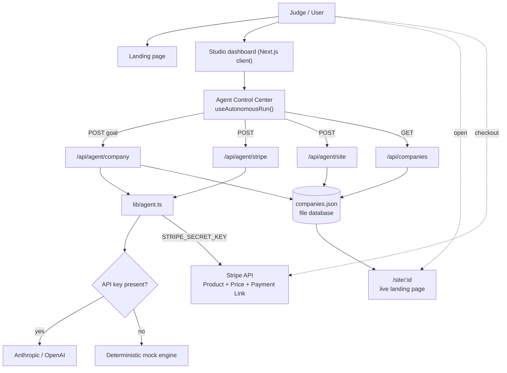

<div align="center">

# VentureOS

### The Autonomous Venture Studio

Describe a goal in one sentence. An AI agent discovers a startup opportunity, incorporates the company, designs pricing, writes and **deploys a live landing page**, mints a **real Stripe Payment Link**, and visualizes the entire zero-to-revenue run in real time.


</div>

---

## Project Overview

**VentureOS** is an autonomous venture studio in your browser. A single prompt kicks off an agent that runs the full founding loop — opportunity discovery, company creation, pricing, landing page, payments and marketing — and renders every step live in a cinematic **Agent Control Center**.

It is *partially real by design*: with zero configuration it generates a company, persists it to a database, and deploys a real, shareable landing page. Add an LLM key and a Stripe key, and the idea/copy generation and checkout link become fully live. Every action in the UI is explicitly labeled **Real** or **Simulated**, so there's no ambiguity about what actually happened.

## Problem

Going from idea to a revenue-ready business means stitching together a dozen disconnected steps — market research, naming, positioning, pricing, a website, payment setup, and launch marketing. It's slow, repetitive, and most of it is undifferentiated work that stalls founders before they ever charge a customer.

## Solution

VentureOS collapses that loop into one autonomous run. The agent:

- finds and scores a real opportunity from a goal,
- generates the company (name, value prop, persona, pricing, landing copy),
- **saves it to a database**,
- **mints a real Stripe Payment Link**,
- **deploys a live landing page** at a shareable URL,
- and simulates go-to-market and first revenue for a complete narrative.

The result is a business that can accept its first customer — assembled and visualized in under two minutes.

## Features

- **Agent Control Center** — a split view: *Real AI outputs* on the left, *Agent activity timeline* on the right, with animated counters, a streaming Stripe ledger, a live revenue curve and stage-by-stage transitions.
- **Real / Simulated labels** — every stage, ledger entry and output is tagged so judges and users see exactly what's real.
- **Judge Mode** — one click auto-runs the full workflow at a relaxed pace (~60-90s), auto-scrolls key events, and ends on the success screen. Zero interaction required.
- **Real LLM generation** — idea, name, pricing and landing copy from Anthropic Claude or OpenAI (mock fallback with no key).
- **Real database** — generated companies persist to a file-backed store; inspect them at `GET /api/companies`.
- **Real Stripe Payment Links** — a live `buy.stripe.com` URL displayed in the dashboard when a Stripe key is present.
- **Live landing pages** — each company's site is generated and served at `/site/{id}`.
- **PDF report** — one-click branded report summarizing everything the agent created.
- **Full Studio** — manual opportunity discovery, company builder, business dashboard, monetization and marketing engine.
- **World-class landing page** — hero, features, demo, pricing and FAQ.
- **Zero-config** — runs instantly with realistic mock data and no API keys.

## Architecture



**Layered design**

- **`app/`** — App Router pages (`/`, `/dashboard`), API route handlers, and the live `/site/[id]` landing pages.
- **`components/`** — `ui` (shadcn/ui primitives), `shared`, `landing`, and `studio` (Control Center + Studio surfaces).
- **`lib/`** — domain logic: `agent.ts` (LLM + Stripe), `agent-run.ts` (client orchestration), `db.ts` (persistence), `landing-template.ts` (HTML generator), `ai.ts` (provider wrapper), `mock-data.ts` (fallback engine).

## Demo Flow

The autonomous run is 8 stages — the first six do real work, the last two are clearly simulated for narrative:

| # | Stage | Mode |
| --- | --- | --- |
| 1 | Discover opportunity | Real LLM · mock fallback |
| 2 | Incorporate company | Real LLM · mock fallback |
| 3 | Design pricing | Real LLM · mock fallback |
| 4 | Write landing page | Real LLM · mock fallback |
| 5 | Create Stripe Payment Link | Real Stripe · demo fallback |
| 6 | Deploy website | **Always real** (`/site/{id}`) |
| 7 | Run go-to-market | Simulated |
| 8 | Acquire customers & revenue | Simulated |

It ends on a success screen with the **startup name, landing-page URL, Stripe checkout URL, Business status: Operational, time to launch, and agent actions completed**, plus a downloadable PDF report and a one-click reset.

> **Fastest path:** open `/dashboard?sim=1` (or click **Judge Mode**) and watch it run end to end.

## Tech Stack

| Layer | Technology |
| --- | --- |
| Framework | Next.js 15 (App Router), React 19 |
| Language | TypeScript |
| Styling | Tailwind CSS, shadcn/ui (new-york) |
| Animation | Framer Motion |
| Charts | Recharts |
| State | Zustand |
| Payments | Stripe (Payment Links, Checkout) |
| AI | Anthropic Claude · OpenAI (pluggable, mock fallback) |
| PDF | jsPDF |
| Storage | File-backed JSON store (swappable for Postgres / Vercel KV) |
| Deploy | Vercel-ready |

## Installation

Requires **Node.js 18.18+**.

```bash
git clone https://github.com/<your-username>/ventureos.git
cd ventureos
npm install
npm run dev
```

Open [http://localhost:3000](http://localhost:3000). It works immediately with mock data — no keys needed. To enable live AI and Stripe, see below.

```bash
# optional: enable real AI + Stripe
cp .env.example .env.local
# then fill in keys and restart
```

| Script | Description |
| --- | --- |
| `npm run dev` | Start the dev server |
| `npm run build` | Production build |
| `npm run start` | Serve the production build |
| `npm run typecheck` | Type-check without emitting |

### Deploy to Vercel

Push to GitHub and import at [vercel.com/new](https://vercel.com/new). Add any keys as environment variables. For a multi-instance deployment, wire a managed database (see [Future Work](#future-work)).

## Environment Variables

All variables are **optional** — the app runs fully without them. Copy `.env.example` to `.env.local` to enable real actions.

| Variable | Required | Purpose |
| --- | --- | --- |
| `AI_PROVIDER` | No | `mock` (default), `anthropic`, or `openai` |
| `OPENAI_API_KEY` | No | Enables live generation via OpenAI |
| `ANTHROPIC_API_KEY` | No | Enables live generation via Claude |
| `STRIPE_SECRET_KEY` | No | Mints real Stripe Payment Links |
| `NEXT_PUBLIC_STRIPE_PUBLISHABLE_KEY` | No | Stripe.js publishable key |
| `NEXT_PUBLIC_APP_URL` | No | Base URL for absolute links / Stripe redirects |

## Screenshots

> Drop your own captures into `docs/screenshots/` and they'll render here.

| View | File |
| --- | --- |
| Landing page | `docs/screenshots/landing.png` |
| Agent Control Center (running) | `docs/screenshots/control-center.png` |
| Success screen | `docs/screenshots/success.png` |
| Generated live site (`/site/{id}`) | `docs/screenshots/site.png` |

<!-- Once added:


-->

## Future Work

- **External deploys** — push generated sites to Vercel/Netlify via API (`VERCEL_TOKEN`) for standalone URLs.
- **Managed database** — drop-in Postgres / Vercel KV / Upstash behind the existing `lib/db.ts` interface for durable, multi-instance persistence.
- **True agentic payments** — let the agent provision and pay for real tools via Stripe Issuing instead of simulating spend.
- **Idea evaluation loop** — score and refine generated opportunities with retrieval over live market data.
- **Auth & multi-tenant** — accounts, saved ventures, and team workspaces.
- **More verticals & templates** — expand the opportunity library and landing-page styles.
- **Live customer acquisition** — replace simulated growth stages with real campaign and analytics integrations.

## License

[MIT](LICENSE) © 2026 Serkan Tahtakaya (Woodstone Studio)

<div align="center">
<sub>Built with <b>Hermes + NVIDIA + Stripe</b>.</sub>
</div>
