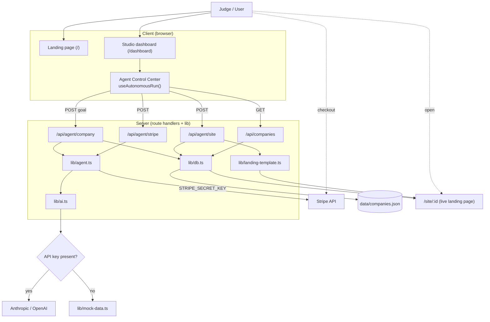

# Architecture

VentureOS is a Next.js 15 (App Router) application split into three layers: **routes/pages** (`app/`), **UI** (`components/`), and **domain logic** (`lib/`). The autonomous run is orchestrated on the client, which calls server route handlers that do the real work (LLM, database, Stripe, deploy).

## System diagram



## Request lifecycle (one autonomous run)

1. **Discover + create** — the client posts the goal to `/api/agent/company`. `lib/agent.ts` calls the configured LLM via `lib/ai.ts` (or falls back to `lib/mock-data.ts`), then `lib/db.ts` persists the `CompanyRecord`. Returns `{ id, company, mode }`.
2. **Reveal** — pricing and landing copy from that single response are revealed across stages 2-4 for a staged, cinematic feel.
3. **Payments** — `/api/agent/stripe` calls Stripe to create a Product, Price and **Payment Link** (or returns a labeled demo link). The record is updated with the URL.
4. **Deploy** — `/api/agent/site` marks the company deployed; the page is served live at `/site/{id}` by `lib/landing-template.ts`.
5. **Simulated growth** — stages 7-8 (tools, marketing, customers, revenue) run client-side as clearly-labeled simulation for the demo narrative.
6. **Proof** — `/api/companies` returns the persisted records, surfaced as a database count in the UI.

## Data model

```ts
CompanyRecord {
  id: string
  goal: string
  company: AgentCompany        // idea, name, domain, tagline, valueProp, pricing[], landing
  generationMode: "real" | "simulated"
  stripeUrl?: string
  stripeMode?: "real" | "simulated"
  siteDeployed?: boolean
  siteUrl?: string
  createdAt: number
}
```

## Swapping the database

`lib/db.ts` exposes four functions — `saveCompany`, `updateCompany`, `getCompany`, `listCompanies`. Re-implement them against Postgres, Vercel KV or Upstash and the rest of the app is unchanged.
